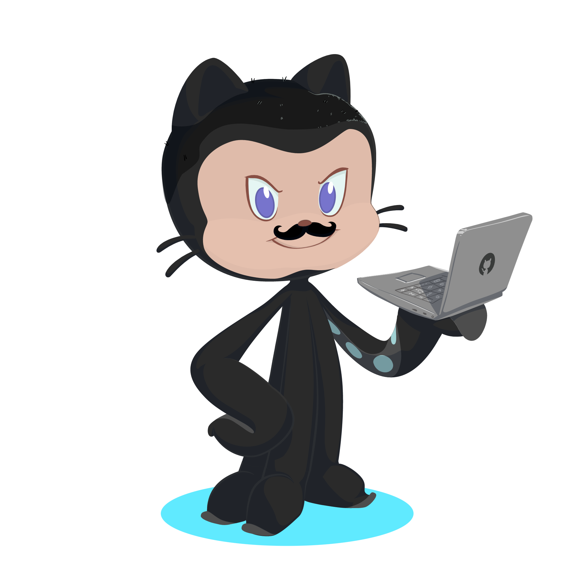

## Oi, sou o Lucas! 

### Bem vindo ao meu perfil do GitHub 🖖🏼

- 🔭 Atualmente trabalho como desenvolvedor web na Zukkin Brasil.

📫 Quer me achar?

**Linguagens e Ferramentas:**

   </a> <a href="https://developer.mozilla.org/en-US/docs/Web/JavaScript" target="_blank">              
 

   

